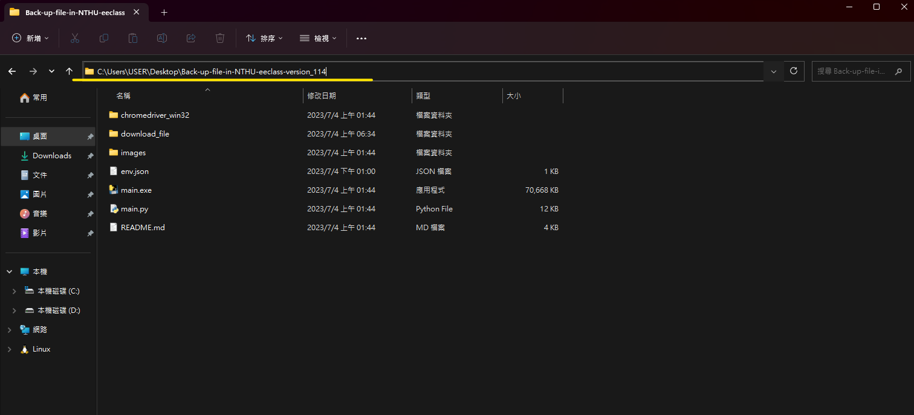
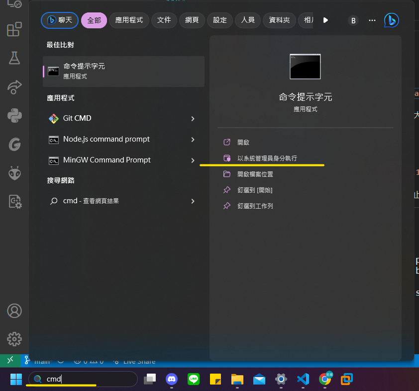
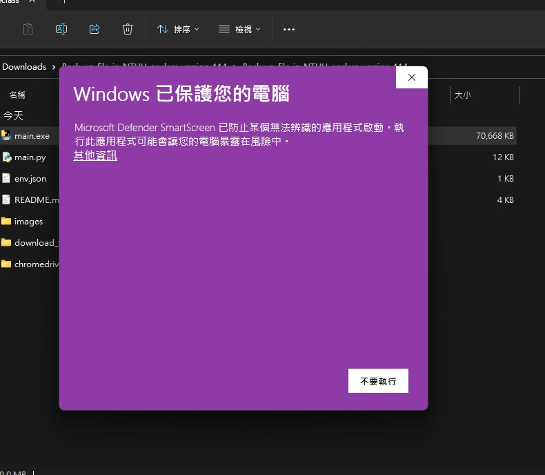

- [Back up HW in NTHU eeclass](#back-up-hw-in-nthu-eeclass)
  - [目的](#目的)
  - [執行影片](#執行影片)
  - [使用限制](#使用限制)
  - [前置作業](#前置作業)
    - [確認 Google Chrome 版本](#確認-google-chrome-版本)
      - [\[step1\] 點選右上角的3顆點點 -\> 說明 -\> 關於 Google Crome](#step1-點選右上角的3顆點點---說明---關於-google-crome)
      - [\[step2\] 可以在下圖方框中查看目前使用的 Google 版本 ](#step2-可以在下圖方框中查看目前使用的-google-版本-)
      - [\[step3\] 下載本專案](#step3-下載本專案)
    - [紀錄登入 eeclass 時使用的 cookie](#紀錄登入-eeclass-時使用的-cookie)
      - [\[step1\] 登入eeclass](#step1-登入eeclass)
      - [\[step2\] 在頁面上按壓鍵盤 ctrl + shift + i -\> 選擇 Network欄位](#step2-在頁面上按壓鍵盤-ctrl--shift--i---選擇-network欄位)
      - [\[step3\] 刷新頁面會跑出載入頁面時使用的資料](#step3-刷新頁面會跑出載入頁面時使用的資料)
      - [\[step4\] 紀錄cookie](#step4-紀錄cookie)
      - [\[step5\] 將參數放入 **env.json**](#step5-將參數放入-envjson)
    - [設定下載路徑](#設定下載路徑)
      - [\[step1\] 點擊電腦下載檔案後被放置的資料夾](#step1-點擊電腦下載檔案後被放置的資料夾)
      - [\[step2\] 在資料夾內部點擊滑鼠右鍵 -\> 點擊內容](#step2-在資料夾內部點擊滑鼠右鍵---點擊內容)
      - [\[step3\] 紀錄您電腦的下載路徑](#step3-紀錄您電腦的下載路徑)
      - [\[step4\] 將路徑參數放入 **env.json**](#step4-將路徑參數放入-envjson)
    - [將Download底下的文件全部清光](#將download底下的文件全部清光)
  - [開始使用](#開始使用)
      - [\[step1\] 紀錄專案資料夾路徑](#step1-紀錄專案資料夾路徑)
      - [\[step2\] 以系統管理員的身分開啟cmd](#step2-以系統管理員的身分開啟cmd)
      - [\[step3\] 開始爬蟲 !](#step3-開始爬蟲-)
      - [\[step4\] 保持畫面乾淨](#step4-保持畫面乾淨)
      - [\[step5\] 程式結束後檔案會在 download\_file 資料夾之下](#step5-程式結束後檔案會在-download_file-資料夾之下)
      - [\[warning\] 可能會有的Bug](#warning-可能會有的bug)
  - [修復 Bug](#修復-bug)
    - [Windows 已保護您的電腦](#windows-已保護您的電腦)
    - [下載-掃描病毒失敗](#下載-掃描病毒失敗)
    - [Chromedriver閃退、自動關閉](#chromedriver閃退自動關閉)

# Back up HW in NTHU eeclass

## 目的

自動下載**歷屆作業**的檔案。 
> 只能下載這個區塊的檔案，被放在其他地方的檔案作者抓不到QwQ

## 執行影片

## 使用限制

必須使用 **Google Chrome**

## 前置作業

### 確認 Google Chrome 版本
#### [step1] 點選右上角的3顆點點 -> 說明 -> 關於 Google Crome

#### [step2] 可以在下圖方框中查看目前使用的 Google 版本  
  e.g. 作者現在的版本是 **114.5735.199** ，也就是 114版

#### [step3] 下載本專案

根據自己的 Google 版本，下載對應的版本  
> 作者是Google 114版，因此這邊選擇 v114，v114 代表version 114  
> 請根據自己的版本選擇對應的資料夾

| 版本                    | 文件大小 | 載點     |
|------------------------|-----------|--------------|
| ChromeDriver_v110 |  75.2 MB  | [**Win64_ChromeDriver_v110**][Win64_ChromeDriver_v110] |
| ChromeDriver_v111 |  75.2 MB  | [**Win64_ChromeDriver_v111**][Win64_ChromeDriver_v111] |
| ChromeDriver_v112 |  75.2 MB  | [**Win64_ChromeDriver_v112**][Win64_ChromeDriver_v112] |
| ChromeDriver_v113 |  75.2 MB  | [**Win64_ChromeDriver_v113**][Win64_ChromeDriver_v113] |
| ChromeDriver_v114 |  74.7 MB  | [**Win64_ChromeDriver_v114**][Win64_ChromeDriver_v114] |
| ChromeDriver_v121 |  76.5 MB  | [**Win64_ChromeDriver_v121**][Win64_ChromeDriver_v121] |

[Win64_ChromeDriver_v110]: https://github.com/YEH-YU-YANG/Back-up-file-in-NTHU-eeclass/releases/download/v1.0/Win64_ChromeDriver_v110.zip
[Win64_ChromeDriver_v111]: https://github.com/YEH-YU-YANG/Back-up-file-in-NTHU-eeclass/releases/download/v1.0/Win64_ChromeDriver_v111.zip
[Win64_ChromeDriver_v112]: https://github.com/YEH-YU-YANG/Back-up-file-in-NTHU-eeclass/releases/download/v1.0/Win64_ChromeDriver_v112.zip
[Win64_ChromeDriver_v113]: https://github.com/YEH-YU-YANG/Back-up-file-in-NTHU-eeclass/releases/download/v1.0/Win64_ChromeDriver_v113.zip
[Win64_ChromeDriver_v114]: https://github.com/YEH-YU-YANG/Back-up-file-in-NTHU-eeclass/releases/download/v1.0/Win64_ChromeDriver_v114.zip
[Win64_ChromeDriver_v121]: https://github.com/YEH-YU-YANG/Back-up-file-in-NTHU-eeclass/releases/download/v1.0/Win64_ChromeDriver_v121.zip

> 解壓縮該檔案 -> 把它放到 Download 資料夾以外的地方。  
> 這步驟非常重要 !

### 紀錄登入 eeclass 時使用的 cookie

#### [step1] 登入eeclass
  

#### [step2] 在頁面上按壓鍵盤 ctrl + shift + i -> 選擇 Network欄位 
  

#### [step3] 刷新頁面會跑出載入頁面時使用的資料
  

#### [step4] 紀錄cookie
  
刷新eeclass頁面，Network欄位會刷新資料  
點選dashboard -> Cookies -> 找到PHPSESSID  
這個值請紀錄下來，稍後會用到。**千萬不要外流**，自己知道就好，

#### [step5] 將參數放入 **env.json**

如下圖所示，將env.json打開  
把剛剛得知的cookie放在value欄位

### 設定下載路徑

#### [step1] 點擊電腦下載檔案後被放置的資料夾
  

#### [step2] 在資料夾內部點擊滑鼠右鍵 -> 點擊內容

#### [step3] 紀錄您電腦的下載路徑

>以這張圖來說，作者的下載路徑是 C:\Users\User\Downloads

#### [step4] 將路徑參數放入 **env.json**

> 注意 !!! 要將下載路徑中全部的單斜線 ( \\ ) 換成雙斜線 ( \\\\ )  
>  比方說 : C:\Users\User\Downloads -> C:\\\Users\\\User\\\Downloads

### 將Download底下的文件全部清光

如下圖

## 開始使用

#### [step1] 紀錄專案資料夾路徑

打開專案資料夾 -> 對圖中黃線的欄位按一下 -> 紀錄這個路徑
> 以這張圖來說，作者的專案路徑是  
>  `C:\Users\USER\Desktop\Back-up-file-in-NTHU-eeclass-version_114`

#### [step2] 以系統管理員的身分開啟cmd

尋找你的 Command line (cmd) -> 以系統管理員身分執行

#### [step3] 開始爬蟲 !

輸入指令，分別是 :  

* 第一個指令 `cd 剛剛紀錄的專案路徑` 。 
  舉例: `cd C:\Users\USER\Desktop\Back-up-file-in-NTHU-eeclass-version_114`。 
  > 注意 `cd` 跟路徑之間要有空格。這個指令代表進入專案

* 第二個指令 `main.exe`。 
  > 這個指令代表開始爬蟲 !

#### [step4] 保持畫面乾淨

執行過程中請確保以下事項:
* 確保畫面裡只有 Google Chrome 的畫面。 執行 `main.exe` 時會跳出小黑框，請不要讓它顯示在畫面之中
* 不要移動滑鼠，程式會控制滑鼠感應，被亂移動的話會出大事
* 確保網路順暢，檔案下載的速度取決於您的網路有多快

#### [step5] 程式結束後檔案會在 download_file 資料夾之下

#### [warning] 可能會有的Bug

如果過多檔案下載-掃描病毒失敗，詳見底下的 [修復Bug3.2] 內容。

如果執行後發現會有個視窗瞬間跳出來又關閉，並且程式停止，詳見底下的 [修復Bug3.3] 內容。

## 修復 Bug

### Windows 已保護您的電腦

這很正常，點選其他資訊 -> 仍要執行。

### 下載-掃描病毒失敗

根據這篇文章的內容[修復 Google Chrome 病毒掃描失敗錯誤的 5 大方法](https://www.a7la-home.com/zh-TW/top-ways-to-fix-virus-scan-failed-error-in-google-chrome) 選擇第四個方法執行。

### Chromedriver閃退、自動關閉

順利執行的情況下，Chrome driver會一直跳轉頁面，直到全部的檔案下載完畢。
順勢閃退、自動關閉，代表您選擇的Chrome driver和您現在的Google版本不一致，請重新安裝正確的版本。
